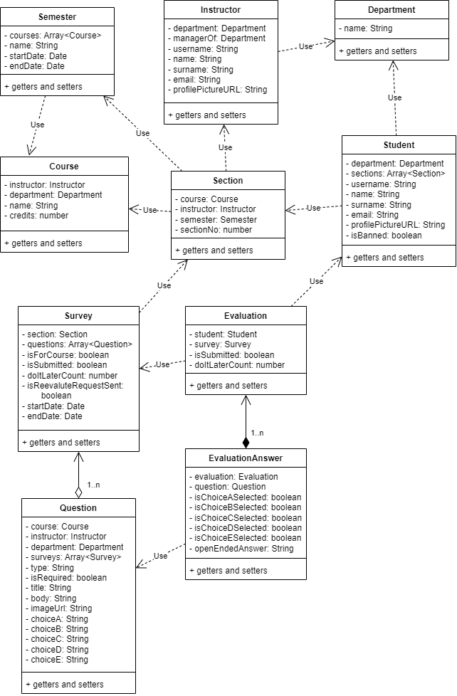

# DOCUMENTATION

# 1- Entity Relationship Diagram

# 2- UML Diagram

# 3- REST API Endpoints

- Open the document that gives information about REST API endpoints and related Java Classes in Spring framework.

[REST API Document](./backend/REST%20API.pdf)

- Open the document that gives general project details about all use cases and assumptions.

[Notes Document](./Notes.docx.pdf)

# 4- [Use_Case_Definition](./documents/Use_Case_Definition.docx.pdf)

# 5- [Software_Test_Report](./documents/Software_Test_Report.docx.pdf)

# 6- [Software_Requirements_Specifications](./documents/Software_req_spec.docx.pdf)

# 7- [Risk Management Report](./documents/RiskManagementReportTmp_1.docx.pdf)

# 8- [User_Interface_Design](./documents/Graphical_User_Interface_Design.docx.pdf)

# 9- [Config_Change Management](./documents/Config_ChangeManagement_.docx.pdf)

# 10- [Architecture_Notebook](./documents/Architecture_notebook_tpl.docx.pdf)
